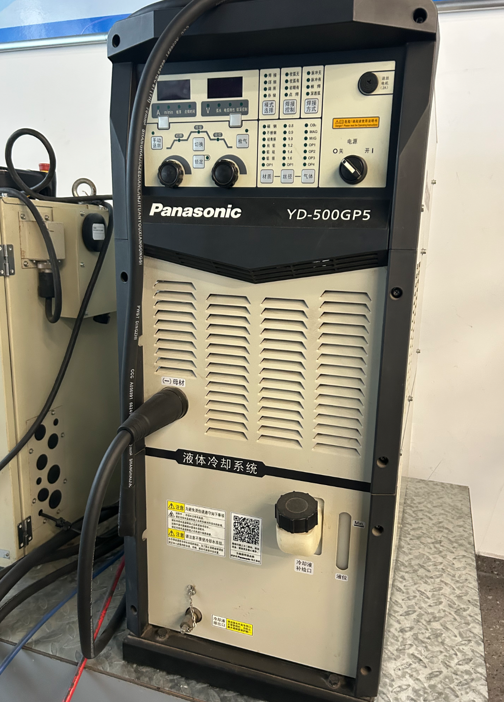
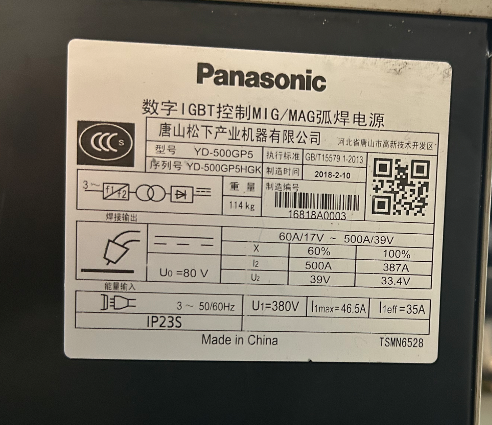

# Comparative Analysis of High-Power Welding Power Supply and Low-Voltage DC Motor Drive

## Background

In Project A (STM32 Motor PID Closed-Loop Control), I used the TB6612FNG module to drive a 12V DC geared motor. During the first power-up, the module burned due to insufficient VM pin voltage rating (10V) and reverse electromotive force (back-EMF) spikes. The problem was resolved by replacing the module with a ≥15V-rated version, adding a 100μF electrolytic capacitor in parallel to absorb back-EMF voltage spikes, and inserting 1kΩ current-limiting resistors in series with all control signal lines to protect the GPIO pins.

During my internship at Tianyi Welding, I investigated the Panasonic YD-500GP5 digital IGBT inverter welding machines. By conducting a comparative analysis between an industrial-grade high-power drive system and the low-voltage DC drive system I built myself, I gained new insights into drive topology, power device selection, protection strategies, and reliability engineering.

## 1. Power-Level Comparison

The Panasonic YD-500GP5 delivers a rated output of 500A at 39V (in Pulse OFF mode) with a rated input capacity of 29.9kVA. Calculated at rated output, the power is approximately 19.5kW (500A × 39V). In comparison, the DC geared motor in my project operates at a rated voltage of 12V with a normal operating current of approximately 0.5A, yielding a power of roughly 6W. The industrial welding machine's rated output power is approximately 3,250 times that of my desktop drive system.

| Parameter | Panasonic YD-500GP5 | TB6612 + JGB37-520 | Ratio |
|:---|:---|:---|:---|
| Input Voltage | 3-Phase AC 380V | DC 12V | 31.7× |
| Rated Output Voltage | DC 39V | DC 12V | 3.25× |
| Rated Output Current | 500A | ~0.5A | 1,000× |
| Rated Output Power | ~19.5kW | ~6W | ~3,250× |
| Open-Circuit Voltage | DC 80V | — | — |
| Power Device Voltage Rating | IGBT 650V | Integrated MOSFET ~30V | 21.7× |

The difference in power levels is not merely a numerical amplification; it represents a comprehensive upgrade in drive topology, power device selection, thermal management, and protection strategy. A low-voltage DC motor drive can be implemented using a single integrated H-bridge chip, whereas a 500A-class welding power supply requires a multi-stage power conversion architecture comprising three-phase rectification, full-bridge IGBT inversion, medium-frequency transformer isolation, and secondary fast-recovery diode rectification.

## 2. Power Device Selection Comparison

The Panasonic YD-500GP5 employs IGBTs as the core power switching devices with a voltage rating of 650V. After rectification and filtering of the three-phase 380V AC input, the DC bus voltage peaks at approximately 537V. The 650V rated IGBT provides a voltage safety margin of approximately 21% relative to the 537V bus voltage.

In my TB6612 module, the integrated MOSFET (built into the chip) with a rated withstand voltage of 10V was subjected to a fully charged LiPo battery voltage of 12.6V, exceeding the absolute maximum rating of the device. This overvoltage caused the internal H-bridge MOSFET to break down and burn out.

The industrial welding machine maintains a clear voltage safety margin in power device selection (approximately 21%), whereas the low-cost, low-voltage module sacrificed margin design to reduce cost and could not tolerate even 1V of overvoltage. This taught me that the "absolute maximum rating" specified in datasheets is a design boundary, not a value to be relied upon for normal operation. In practical engineering, adequate design margin must always be maintained beyond the maximum rated values.

## 3. Protection Strategy Comparison

In Project A, I added only two protection components: a 100μF electrolytic capacitor (to absorb back-EMF voltage spikes) and six 1kΩ current-limiting resistors (to limit the fault current if the TB6612 failed). This was basic functional-level protection — a remedial measure implemented only after the module had already burned out.

The Panasonic YD-500GP5 incorporates a multi-layered protection system.

**Input-side protection**: An external distribution box is configured with a 40A fuse and a 50A circuit breaker (for the 500 model) as the first level of overcurrent and short-circuit protection. Inside the machine, independent fuses are provided for the wire feeder motor circuit (8A), the heater circuit (8A), and the voltage detection circuit (3A), achieving isolated fault protection for each functional loop.

**Voltage anomaly protection**: The welding machine features input overvoltage, undervoltage, and phase-loss detection. When the input voltage exceeds the permissible range (304V–437V) or a phase loss occurs, Err-004 (overvoltage) or Err-005 (undervoltage/phase loss) alarms are triggered, and the machine shuts down automatically to prevent damage to power devices from abnormal power supply conditions.

**Overtemperature protection**: A temperature anomaly indicator is located on the front panel. Thermal relays continuously monitor the temperatures of the IGBT heat sink and the reactor. When the temperature exceeds the safety threshold, the indicator flashes and the welding output is automatically cut off. Liquid-cooled models are additionally equipped with coolant circulation monitoring and automatically enter a power-saving mode after 7 minutes of standby.

**Output anomaly protection**: During power-on self-test, the welding machine checks the output voltage and current. If an anomaly is detected, an Err-008 alarm is triggered and startup is refused. The wire feeder loop has independent overcurrent protection (Err-028) to prevent the wire feed motor drive circuit from burning out if the motor stalls.

In contrast, the only "protection" in my TB6612 drive system was to passively wait for the module to burn out, then replace it and add capacitors and resistors externally. The industrial welding machine, however, implements active detection and protection mechanisms at the input side, the power stage, the thermal management system, and the output side — capable of warning before a fault occurs or promptly cutting off the output when a fault happens to prevent cascading damage.

## 4. Thermal Design Comparison

I did not implement any thermal management for the TB6612 module. Although the module does not generate significant heat during normal operation, the chip junction temperature can rise continuously under repeated start-stop cycles, stall conditions, or prolonged high-duty-cycle operation. The absence of thermal design means relying entirely on the package's own thermal capacitance to absorb instantaneous temperature rises.

The Panasonic YD-500GP5 employs forced-air cooling with two internal cooling fans that provide forced convection cooling for the IGBT heat sink and the reactor. Liquid-cooled models additionally use a pump to drive coolant circulation, dissipating heat through an external radiator. Meanwhile, temperature sensors monitor the heat sink and reactor temperatures in real time; if an over-temperature condition occurs, the output is automatically cut off and an alarm is triggered. This forms a complete thermal management system encompassing cooling, monitoring, and protection.

In industrial high-power equipment, thermal management is not an optional accessory — it is a core component of system design. Without effective cooling, any power device will fail due to overheating within a short period.

## 5. Duty Cycle: A Concept Entirely Foreign to My Previous Experience
In my own project, I had never once considered the question of "how long can this module continuously operate at full power?" The TB6612 datasheet may contain thermal resistance parameters, but I had completely ignored them. I simply assumed it could operate continuously under any load until it overheated and burned out.

The nameplate of the Panasonic YD-500GP5 explicitly states a rated duty cycle of 60% — 6 minutes at full load and 4 minutes idle within every 10-minute period. More importantly, it also specifies the condition for 100% continuous operation: output current ≤387A. This means:

- At the full rated current of 500A, the welding machine cannot operate continuously without limits. It must "rest" for 4 minutes out of every 10 to allow the IGBTs and transformer to cool down.
- At 387A or below, the welding machine can operate continuously around the clock without de-rating.

This is a design dimension I had never been aware of before: the output capability of a high-power device is not just "what is the maximum it can output," but also "what can it sustainably output." Full-power operation is typically time-limited, while true continuous operation requires de-rating. This distinction between "rated" and "continuous" capability directly determines the usability of equipment in real production environments.

| Parameter | Nameplate Marking | Description |
|:---|:---|:---|
| Rated Duty Cycle | 60% | 6 minutes at full load, 4 minutes idle within a 10-minute period |
| 100% Continuous Duty Condition | Output current ≤387A | Continuous operation without de-rating is possible at or below 387A |

## 6. Engineering Insights Gained from This Comparison

In my desktop project, the protection scheme was reactive: I only knew to add a capacitor after burning the module, and only knew to add resistors after frying the MCU. In the industrial welding power supply, protection is proactive design: from the input-side fuses and circuit breakers, to the DC bus overvoltage and undervoltage detection, to the IGBT temperature monitoring and overtemperature shutdown, to the output-side anomaly detection — every layer of protection acts before or at the moment a fault occurs.

Industrial equipment must operate stably under harsh conditions — high temperature, high humidity, dust, strong electromagnetic interference, and 24-hour continuous operation. In such an environment, a single unmitigated voltage spike, a brief overheating event, or a loose terminal connection can cause a production line shutdown, resulting in losses far exceeding the cost of the equipment itself. Therefore, the protection design of industrial equipment follows the principle of "better a false stop than a real failure," with redundant protection configured at every point where a fault could occur.

This internship allowed me to see the gap between my desktop project and a real industrial product. It also gave me my first real exposure to reliability engineering. This will be invaluable for my future work in embedded systems or power electronics R&D.
