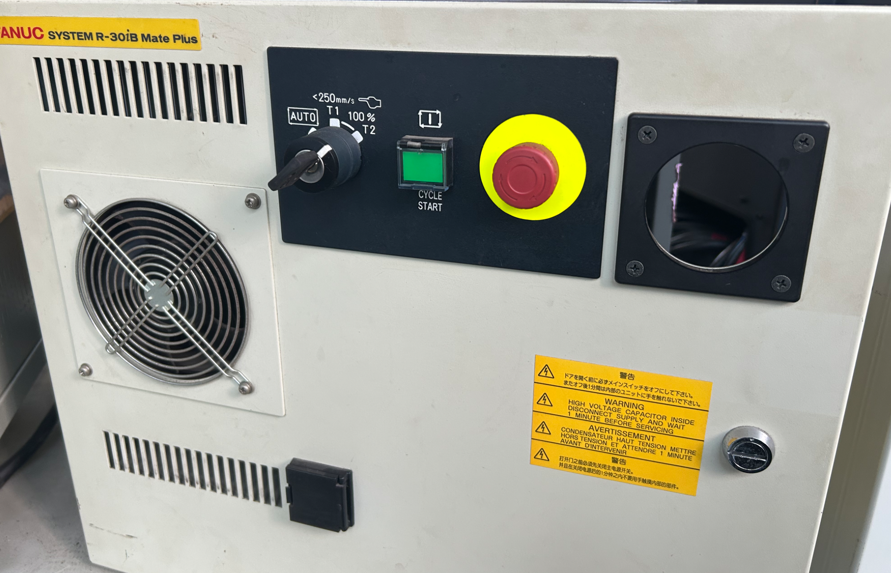
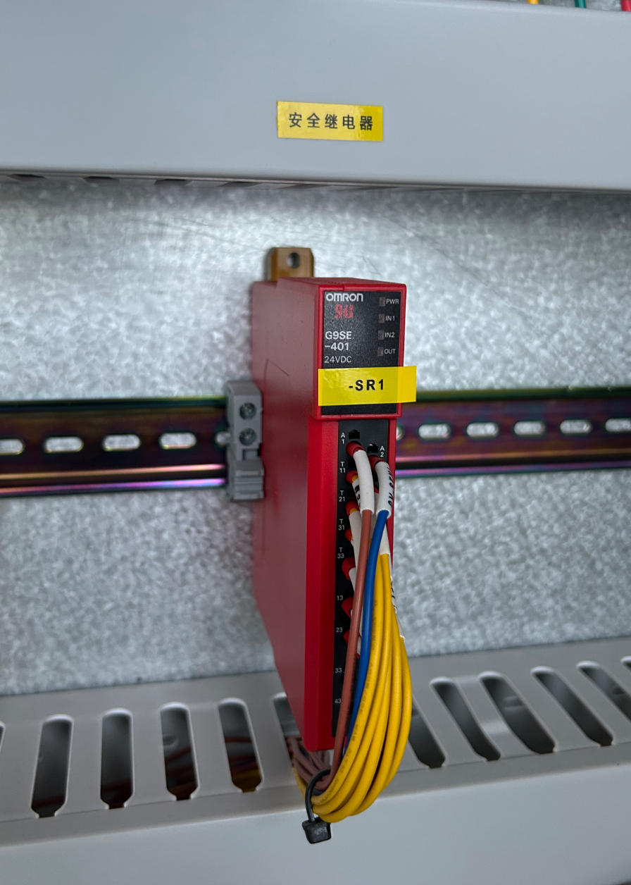
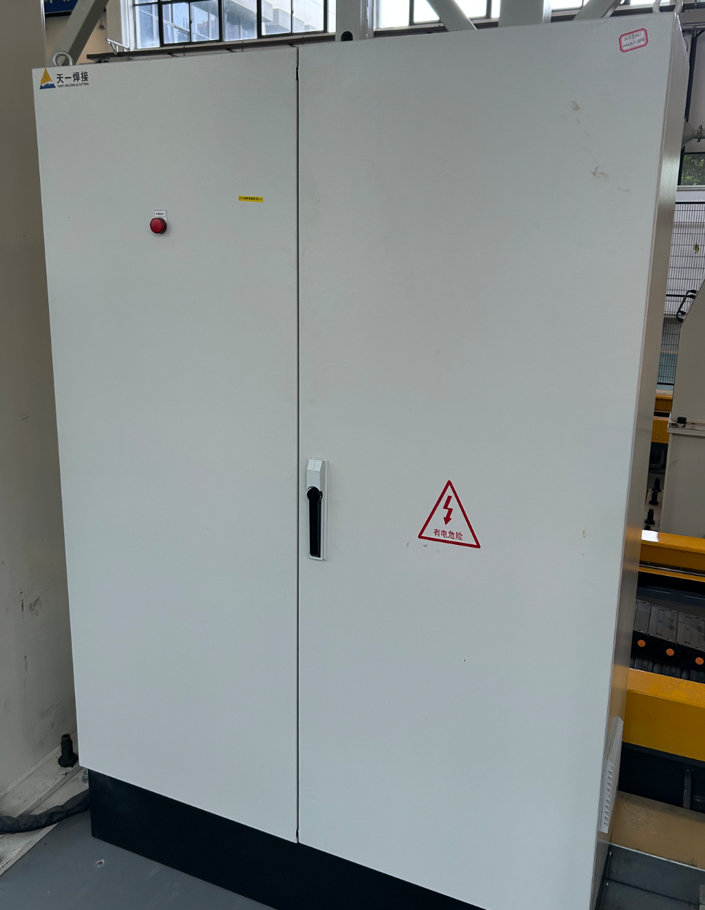
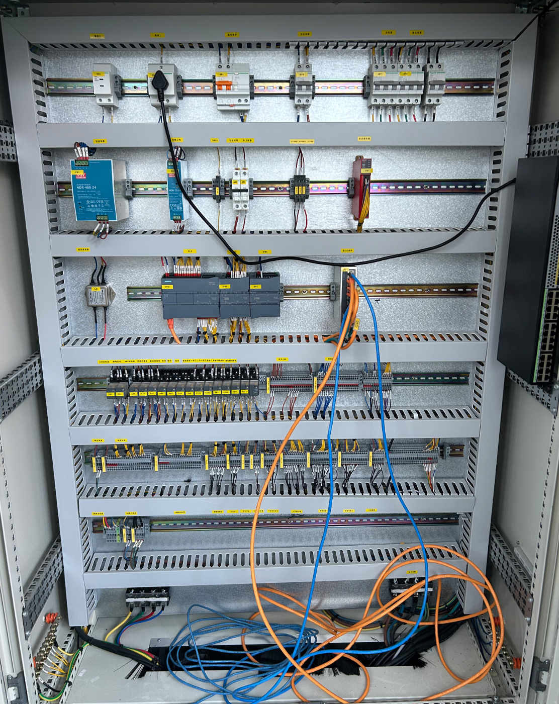

# Industrial Electrical Safety Design and I/O Isolation: From Desktop Capacitor-Resistor Protection to Multi-Layer Industrial Safety Systems

## Background

In Project A (STM32 Motor PID Closed-Loop Control), I experienced two hardware failures that fundamentally changed how I think about circuit protection. The first was the TB6612 motor driver module burning out on first power-up — the VM pin was rated for only 10V, but my fully charged 3S LiPo battery output 12.6V. The overvoltage exceeded the absolute maximum rating and destroyed the internal H-bridge MOSFET. The second and more serious failure occurred days later: the STM32 main chip suddenly overheated and emitted smoke during a test run. The root cause was traced to the TB6612 internally failing and allowing 12V from the motor supply rail to backfeed through the control signal lines into the STM32's GPIO pins, far exceeding the absolute maximum GPIO voltage of VDD + 0.3V (approximately 3.6V).

My solution at the time was to add a 100μF electrolytic capacitor across the motor power rail to absorb back-EMF spikes, and insert six 1kΩ current-limiting resistors in series with all control signal lines. These were functional, low-cost fixes — but they were reactive measures taken after failures had already occurred.

During my internship at Tianyi Welding, I had the opportunity to study industrial-grade electrical safety design by analyzing actual electrical schematics of a welding automation production line. The gap between my desktop protection approach and industrial practice turned out to be far larger than I had imagined. Industrial safety is not about adding a capacitor here and a resistor there — it is a systematic, multi-layered, proactively designed engineering discipline.

## 1. Emergency Stop Button Design and Safety Relay Loop

The emergency stop (E-stop) system is the most critical safety circuit on any industrial production line. Unlike the simple on/off switch I used in my desktop project, the industrial E-stop system is a dedicated, independently powered safety loop that operates completely outside normal PLC program control.

### 1.1 Physical Design and Layout

All E-stop buttons follow strict industrial standards. They use a red mushroom-head, self-locking design — highly visible against any background, easy to strike in an emergency, and requiring a deliberate rotary twist to release, preventing accidental restoration of power. At least three E-stop buttons are deployed at every automation workstation: one on the control cabinet door, one at the robot operator station, and one at the production line entrance. All E-stop buttons are wired with their normally-closed (NC) contacts connected in series into the safety loop — meaning any single button pressed anywhere on the line will break the entire loop and shut down all equipment.

### 1.2 Safety Relay Loop Operation

The E-stop buttons are not connected to the PLC's ordinary digital I/O. Instead, they are wired into the dual-channel safety input of a dedicated safety relay module — model SR14 in the schematic I studied. This safety relay operates on a completely independent 24V DC power supply, physically separate from the standard control power, ensuring that even a failure of the main control system cannot compromise the safety function.

The dual-channel design is the core of industrial functional safety. Both safety input channels (Safety Input 1 and Safety Input 2) receive the same E-stop signal through independent paths. If one channel fails — due to a welded contact, a broken wire, or component damage — the other channel still detects the failure and forces a safe shutdown. This redundancy ensures that no single point of failure can disable the safety function.

The safety relay also features a dedicated reset/feedback input. After an E-stop is triggered and the fault is cleared, the operator must physically rotate the E-stop button to release the lock and then press a separate reset button. Only when the safety relay confirms that all safety contacts are in their normal state and all E-stop buttons have been released will it re-energize its output contacts. This prevents the machine from unexpectedly restarting the moment an E-stop button is released.

The output side of the safety relay uses force-guided contacts — a special relay design where the normally-open and normally-closed contacts are mechanically linked. Even if a contact welds shut due to high current arcing, the other contacts are physically forced to their correct state, guaranteeing a reliable disconnection. The SR14 in the schematic drives four safety output groups (terminals 13-14, 23-24, 33-34, 43-44), which in turn control eight intermediate relays (KA3 through KA10). These intermediate relays are responsible for enabling power to every major subsystem: the VFDs (variable frequency drives), the robot arm, the welding power supply, and the servo mechanisms.

When any E-stop button is pressed, the safety relay de-energizes immediately. All eight intermediate relays drop out simultaneously. Power and enable signals to all equipment are cut off. The entire workstation — not just a single machine — comes to a complete stop.

### 1.3 Comparison with My Desktop Protection

In my desktop project, the only way to stop the motor in an emergency was to toggle the SW1 switch on the TB6612 module or pull the battery connector. There was no dedicated E-stop button, no safety relay, no independent safety loop. If the STM32 froze or the TB6612 failed in a short-circuit condition, I had no reliable way to cut power without physically touching the wiring — which is exactly the scenario industrial safety design is engineered to prevent. Moreover, my protection was single-point: the 1kΩ resistors could limit backfeed current, but there was no redundancy — if a resistor itself failed open, the protection on that channel was lost.

## 2. Control Cabinet Internal Protection Design

The electrical schematic also revealed multiple layers of protection built into the control cabinet itself — protections that go far beyond the component-level measures I applied in my project.

### 2.1 Over-Temperature Protection

On the power side, circuit breakers QF2 through QF5 all feature built-in thermal trip functions. When a circuit is overloaded and the conductor temperature rises beyond the threshold, the breaker automatically trips to disconnect power — a passive, self-acting protection that requires no software intervention. Inside the cabinet, a temperature-controlled switch paired with axial cooling fans provides active thermal management. When the internal cabinet temperature reaches the setpoint, the fans automatically start to exhaust hot air. If the temperature continues to rise beyond a critical threshold, an alarm is triggered, and in severe cases, the main circuit power is cut off. At the component level, the VFDs, servo drives, and welding power supply all have built-in over-temperature detection. When the IGBT or rectifier bridge junction temperature exceeds the safe limit, the device either reduces its load or shuts down entirely.

### 2.2 Anti-Loosening Terminal Design

All internal wiring terminals use industrial-standard spring-clamp or screw-lock designs that maintain reliable contact even under continuous vibration — a common condition in welding environments with heavy machinery operating nearby. The contactors and circuit breakers in the power loop are equipped with anti-loosening washers at their terminals. High-current connections follow specified torque tightening standards to prevent heating and loosening over long-term operation.

### 2.3 Dust Sealing Design

The control cabinet door is fitted with a rubber dust-sealing strip around its entire perimeter, forming a sealed enclosure when closed. The protection rating typically reaches IP20 or higher; for outdoor or heavy-dust workstations, IP54 is specified, blocking welding spatter and metallic dust from entering the cabinet. Cable entry and exit points are sealed with waterproof cable glands, preventing dust and moisture ingress through wiring openings.

### 2.4 Comparison with My Desktop Project

In my desktop project, the TB6612 module, STM32 board, breadboard, and all wiring were entirely exposed — no enclosure, no dust protection, no vibration resistance. The only thermal consideration was whether the chip felt hot to the touch. The terminal connections were standard DuPont headers, which loosened after repeated plugging and unplugging. This worked adequately for a short-term desktop experiment, but would be completely unacceptable in an industrial environment where equipment must operate reliably for years under harsh conditions.

## 3. Production Line Equipment Duty Cycle and Service Life

Industrial equipment is designed with explicit duty cycle ratings and service life expectations — concepts that are entirely absent from prototyping platforms like the STM32 and TB6612 modules I used.

### 3.1 Duty Cycle

The welding automation production line typically operates on a two-shift schedule (16 hours per day), with some high-volume stations supporting 24-hour continuous operation. Electrical components are generally designed for S1 continuous duty. The welding power supply, however, is subject to a 60% rated duty cycle (defined over a 10-minute period: 6 minutes at full load, 4 minutes at idle). For long-duration, full-load welding, the output must be de-rated to prevent overheating.

### 3.2 Design Service Life

Core electrical components — PLC, VFD, safety relay — have a design life of 10 to 15 years, with mechanical operating life exceeding one million cycles. The welding power supply itself has a design service life of 7 to 10 years, with wear parts — contact tips, wire feed rollers, fuses — replaced on a scheduled basis. Mechanical actuators — robot arms, linear guides — have a design life of 5 to 8 years, extendable through regular lubrication and maintenance.

### 3.3 Scheduled Maintenance Plan

A structured maintenance schedule is in place. Daily checks include E-stop function testing, visual cable inspection, and alarm log review. Weekly checks involve internal cabinet dust cleaning, terminal tightness inspection, and cooling fan operation verification. Monthly checks cover sensor calibration, grounding resistance testing, and safety loop integrity testing. Semi-annual checks include deep internal cleaning, power device re-torquing, and insulation resistance testing. Annual checks involve comprehensive performance testing, batch replacement of wear parts, and safety integrity level verification.

### 3.4 Comparison with My Desktop Project

My desktop project had no concept of duty cycle or service life. The TB6612 module was expected to run until it failed — and it did, catastrophically, on first power-up. There was no maintenance schedule beyond visually checking for loose wires. This comparison made me realize that reliability is not an inherent property of a component — it is the result of deliberate design choices about operating margins, environmental protection, and preventive maintenance, all of which are standard practice in industrial engineering but entirely absent from rapid prototyping workflows.

## 4. Industrial I/O Port Isolation Design — The Industrial Solution to the 12V Backfeed Problem

The STM32 burnout I experienced in my project was caused by 12V from the motor supply rail backfeeding through the control signal lines into the GPIO pins. This failure path exists because the TB6612's control inputs and the STM32's GPIO pins share a direct electrical connection — there is no isolation between them. When the TB6612's internal H-bridge MOSFET shorted, the motor supply voltage appeared directly on the signal lines, with no barrier to prevent it from reaching the MCU.

Industrial equipment solves this problem at the architectural level: all external I/O ports are electrically isolated by design. This is not an optional add-on but a standard, mandatory design practice.

### 4.1 Digital Input/Output Isolation

All digital I/O uses optocoupler (photoelectric) isolation. The input side and the output side have no electrical connection whatsoever — signals are transmitted purely through light. If an external 12V or 24V line is accidentally shorted to a signal pin or a backfeed event occurs, the high voltage cannot propagate through the optocoupler into the main control board. The isolation barrier physically blocks the fault current path.

### 4.2 Analog Signal Isolation

For 4–20mA and 0–10V analog signals, isolated amplifiers or signal isolation barriers are used. Both the power supply and the signal path are fully isolated, blocking ground loop currents and voltage backfeed paths. Even if a sensor cable is shorted to a high-voltage line, the isolation barrier protects the analog input channel.

### 4.3 Power Input Protection

Every power input is equipped with a DC-DC isolated power module, followed by a series reverse-polarity protection diode and a self-recovering fuse (PTC). If the power supply polarity is accidentally reversed, the diode blocks current flow and the PTC opens — the circuit simply does not power up, and no damage occurs. This is in stark contrast to my TB6612 module, which had no input protection whatsoever and was destroyed instantly when the input voltage exceeded its rating.

### 4.4 Communication Interface Isolation

Communication ports — Profinet, RS485, and others — are equipped with isolation transformers or optocoupler isolation. This prevents ground potential differences between different pieces of equipment from driving current through the communication chip and causing breakdown. In my project, the CH340 USB-TTL module and the STM32's USART1 shared a common ground with the motor power supply — a potential failure path that, while not triggered in my case, is explicitly designed out of industrial systems.

### 4.5 What This Means for My Own Project

If I were to redesign the control interface between the STM32 and the TB6612, I would insert optocoupler isolators (such as the 6N137 high-speed optocoupler) on all six control signal lines. This would not change the functionality — the PWM and direction signals would still pass through — but it would physically isolate the STM32's GPIO pins from the motor driver's power stage. Even if the TB6612 failed catastrophically and 12V appeared on its control inputs, the optocoupler would block that voltage from reaching the MCU. This is a single design change that would have prevented the most expensive failure in my entire project.

## 5. Cognitive Upgrade: From Reactive Protection to Proactive Safety Design

In my desktop project, my approach to protection was fundamentally reactive. I added a capacitor after the motor driver burned. I added resistors after the MCU fried. Each protection measure was a response to a failure that had already occurred.

The industrial electrical schematics I studied at Tianyi Welding revealed a fundamentally different philosophy. Safety is not a feature added to a completed design — it is the framework within which the design is created. The safety relay loop is independent of the PLC. The E-stop circuit uses dual-channel redundancy. Every I/O port is isolated. Every power supply is protected against reverse polarity. Every power circuit follows a breaker-plus-contactor two-stage architecture. Every terminal is designed to resist vibration. Every cabinet is sealed against dust.

These measures are not clever afterthoughts. They are the accumulated engineering wisdom of decades of industrial accidents, failures, and near-misses, encoded into standards and specifications that every industrial automation system must follow.

This internship gave me my first real exposure to that body of knowledge. It showed me that the gap between a working prototype and a reliable product is not bridged by adding more features — it is bridged by designing for failure from the very beginning.
