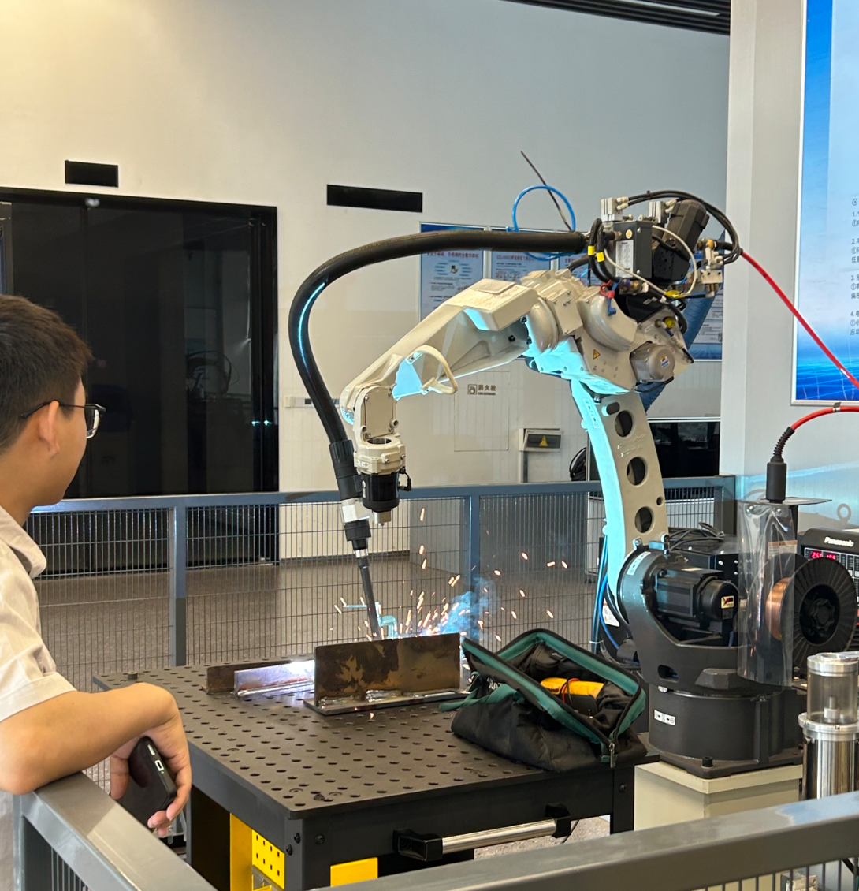
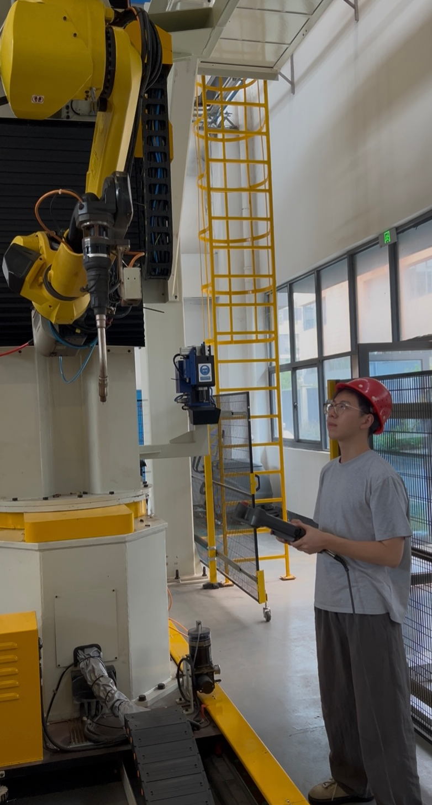

# Robot-Welding Power Supply Coordination: Multi-Device Synchronization in an Industrial Welding Workstation

## Background

In Project B, my robot's control system managed exactly one actuator subsystem: two DC motors driven through a TB6612 H-bridge. The "coordination" problem was trivial — the left and right wheels needed to spin at controlled speeds, and the PID loop handled that. There was no external process to synchronize with, no timing constraints beyond maintaining wheel speed, and no failure mode that could damage equipment or injure a person.

The welding workstation at Tianyi Welding is a fundamentally different kind of system. It integrates a six-axis FANUC robot, a Panasonic YD-500GP5 welding power supply, a wire feeder, a shielding gas solenoid, a laser seam tracking sensor, and a Siemens S7-1200 PLC — all coordinated in real time through a digital fieldbus. Every weld cycle involves precise temporal coordination between mechanical motion, electrical power delivery, material feed, and gas flow. A timing error of even a few hundred milliseconds — gas flowing too late, or wire feeding after the arc has extinguished — can produce a defective weld or damage the equipment.

This report documents my observations of how this multi-device coordination is engineered, from the pre-arc positioning sequence to the post-weld gas shutoff, and compares each element with the far simpler control architecture of my own desktop robot.

## 1. The Complete Welding Cycle: A Temporal Analysis

A single weld cycle in an automated workstation is not a single continuous action. It is a carefully choreographed sequence of sub-processes, each with its own timing requirements and each synchronized with the others through the digital bus. I observed and documented this sequence at the workstation, and it can be broken down into seven distinct phases.

### 1.1 Pre-Positioning

Before welding begins, an operator manually positions the robot at the start point using the teach pendant — or, in more automated setups, the robot moves to a pre-programmed home position and awaits the cycle start signal. This manual positioning phase is a reminder that even in highly automated systems, human intervention remains a critical part of the workflow. The operator's role is not eliminated by automation; it is transformed from "performing the weld" to "setting up the weld."

### 1.2 Pre-Flow of Shielding Gas

Between 1 and 2 seconds before the arc-start command is issued, the shielding gas solenoid valve opens. This pre-flow purges the torch nozzle and gas lines of residual air, ensuring that when the arc ignites, the weld pool is immediately protected from atmospheric contamination. Without this pre-flow, the first few milliseconds of the weld would be exposed to oxygen and nitrogen, producing porosity at the start of the seam.

### 1.3 Arc Ignition

When the robot arrives at the seam start point, it enters a stationary positioning state. The TCP is confirmed to be precisely located at the programmed start point before the robot sends the arc-start command over the fieldbus to the welding power supply. Stationary arc starting is the standard approach for most welding applications, because it minimizes the risk of misalignment and arc wandering at the start point. Only in a small number of high-speed short-seam scenarios does the robot use a low-speed creeping start.

The Panasonic inverter power supply then executes its arc ignition sequence. Upon receiving the start command, it first outputs the open-circuit voltage — typically around 80V — and simultaneously begins feeding wire. When the wire tip contacts the workpiece, a short circuit is created. The welding machine detects this short circuit within microseconds and immediately outputs a large current to melt the wire tip. The arc is then established as the molten metal bridges the gap, and the system transitions to stable arc welding. This entire sequence — from start command to stable arc — typically completes within a few tens of milliseconds.

### 1.4 Steady-State Welding

Once the arc is stable, the robot moves along the weld seam at the programmed welding speed, typically 5 to 20 mm/s for carbon steel arc welding. The welding machine maintains the set current and voltage parameters. Under normal conditions, the welding current exhibits small fluctuations of ±5% to ±10%, caused by the inherent physics of the process — droplet transfer dynamics, small variations in torch height, workpiece surface condition, and assembly gap irregularities. These fluctuations are not faults; they are the natural signature of a stable MIG welding process.

The wire feed speed remains constant in standard constant-speed feeding mode, controlled directly by the wire feed driver board inside the welding machine. For special processes such as pulse welding or cold metal transfer, the wire feed speed can be linked to the welding current for synchronized control, achieving precisely one droplet per pulse.

### 1.5 Crater-Fill and Arc Termination

As the robot approaches the end of the weld seam, it enters the crater-fill segment and begins to decelerate. Simultaneously — not sequentially, but in a coordinated fashion — the welding machine switches to its crater-fill parameters: reduced arc current, reduced arc voltage, and reduced wire feed speed. The two systems work together so that at the exact moment the robot reaches the end point, the arc is cleanly extinguished and the crater is properly filled.

The system supports multiple crater-fill actions to prevent the formation of a concave depression or wire adhesion at the weld terminus. These can include a small circular weaving motion at the end point programmed via the robot, a short backward re-melting pass, a burn-back function built into the welding machine, or a small torch retraction to prevent the wire from sticking to the molten pool. The specific crater-fill strategy is selected based on the welding process and the joint geometry.

### 1.6 Post-Weld Dwell and Gas Post-Flow

After arc extinction, the robot does not immediately move away. It dwells at the crater point for 0.2 to 1 second. This dwell, combined with the delayed gas shutoff, ensures that the molten pool remains covered by shielding gas until it fully solidifies. Without this protection, the hot weld metal at the end of the seam would be exposed to the atmosphere, producing oxidation and porosity at the terminus.

The shielding gas solenoid valve closes 0.5 to 2 seconds after arc extinction — a parameter that can be adjusted in the welding machine settings or in the robot's I/O logic. The combination of dwell time and gas post-flow duration is a carefully tuned parameter pair, specific to each welding process and material.

### 1.7 Departure

After the dwell period expires, the robot executes its departure motion — typically a rapid repositioning move using joint interpolation — to clear the workpiece and prepare for the next cycle.

### 1.8 A Practical Challenge: Laser Sensor Access in Confined Spaces

One of the most instructive observations I made on the production floor was not a catastrophic failure but a persistent limitation that the engineers work around on a daily basis. The laser seam tracking sensor is mounted adjacent to the welding torch. Before welding begins, the sensor must be positioned close to the seam to scan and locate it accurately. However, when the workpiece geometry involves confined spaces — narrow channels, deep grooves, or tight corners — the combined physical envelope of the torch and the sensor becomes a liability. The sensor assembly is simply too bulky to enter the space.

The workaround is to scan from a greater standoff distance. This introduces two immediate problems. First, measurement accuracy degrades with distance: the laser triangulation principle relies on a known geometry between the laser emitter, the camera, and the target surface. As the standoff increases, the baseline geometry becomes less favorable, and sub-millimeter precision can no longer be guaranteed. Second, the vision software may fail to reconstruct the actual welding model from the longer-range scan. The point cloud becomes sparse, or the laser stripe broadens to the point where the algorithm can no longer reliably extract the groove edges and seam center.

This is a classic engineering trade-off. The sensor's physical size is driven by its optical design — laser diode, industrial camera, narrowband filter, protective housing — which in turn is driven by the need to survive the harsh welding environment. You cannot simply shrink the sensor without losing robustness against arc light, spatter, and fume. The practical solutions employed on site include using different sensor form factors for different joint geometries, pre-scanning with a removable sensor that is mounted only for the locating pass and then retracted, or combining laser sensing with arc sensing for the confined sections where the laser cannot physically reach.

The deeper lesson for me was this: **perception hardware must be designed not just for the ideal case, but for the worst-case geometry of the workpieces it will encounter.** In my own desktop robot, the camera was mounted on a fixed bracket looking ahead. I never once had to consider whether the camera could physically fit into the space it was supposed to perceive. On an industrial robot, this is a daily engineering consideration — and it directly determines whether a particular sensor solution is viable for a given production task.

## 2. The Communication Backbone: EtherNet/IP and the TSMYU813 Interface

The coordination between the robot and the welding power supply is made possible by a digital communication link. Two protocol options are available on the Panasonic machine: EtherNet/IP and DeviceNet.

The EtherNet/IP solution uses the TSMYU813 communication interface board, with a standard RJ45 Ethernet cable as the physical connection. This is the mainstream choice for newly commissioned workstations. The DeviceNet solution uses the TSMYU814 interface board, connected via a five-pin terminal plug, and is more commonly found in early retrofit projects or with older welding machine models.

A structural detail worth noting is where these interface boards are installed. The TSMYU813/814 boards are mounted inside the Panasonic welding power supply's expansion slot — not inside the robot controller cabinet. On the robot side, a corresponding master interface card is installed in the controller's main board expansion slot. This architecture — slave interface on the welding machine, master interface on the robot controller — reflects the master-slave relationship in the communication network: the robot is the primary controller, and the welding machine is a peripheral device under its command.

## 3. Fault Safety Interlocking: Never Let One Device Run Away

The fault safety architecture of the welding workstation is the most important engineering lesson I learned from this internship. In my own project, when something failed — a burned motor driver, an erratic encoder — the system simply stopped working. There was no danger, because the robot was a small desktop device with no capacity to harm anything.

In an industrial welding workstation, failure without proper safety response can mean a torch collision, a fire, a batch of destroyed workpieces, or a serious injury. The safety architecture is therefore designed around a fundamental principle: **when any device fails, the entire system must fail to a safe state — immediately and unconditionally.**

### 3.1 Welding Machine Fault → Robot Response

If the welding machine experiences a fault — arc loss, overcurrent, overheating, insufficient gas pressure — it sends a fault alarm signal to the robot via the fieldbus. The robot's standard response is to immediately pause program execution, stop the current motion while maintaining the current posture, and simultaneously issue an arc-stop command. The robot does not continue along the remaining trajectory — doing so would risk dry-running, seam deviation, or workpiece burn-through. For severe safety-class faults, an even higher-level shutdown protection is triggered.

### 3.2 Robot Fault → Welding Machine Response

The reverse direction is equally important. If the robot experiences a servo alarm, an emergency stop, or a safety circuit break, the robot's safety circuit immediately cuts the welding machine's arc-start enable signal. The welding machine detects the loss of this enable signal and instantly extinguishes the arc and stops the wire feed. The system will never continue feeding wire while the robot is stopped — a condition that could produce a dangerous buildup of molten metal or an uncontrolled arc.

This interlock is implemented with dual redundancy: the hardware safety circuit provides the physical signal interruption, and the software logic provides the coordinated response. Either layer alone would be sufficient to prevent the most dangerous failure modes; the combination ensures robustness even in the presence of a single fault in one of the layers.

### 3.3 The Two Most Common Field Anomalies

The field maintenance team at Tianyi Welding shared two common failure scenarios and their diagnostic approaches.

The first — "the robot moved but the welding machine did not ignite the arc" — is relatively frequent. Common causes include loose arc-start signal cables, an open enable circuit on the welding machine, wire not contacting the workpiece, insufficient gas pressure triggering an interlock, fieldbus communication dropout, or incorrect arc-start parameter settings. The standard diagnostic flow begins with checking the welding machine's status indicator for internal alarms, then systematically verifying the correspondence between the robot's I/O outputs and the welding machine's received signals, then checking cable connections, and finally validating the process parameter settings.

The second — "the welding machine was still welding but the robot stopped" — is extremely rare under standard interlocking logic. When it does occur, it typically indicates a safety circuit wiring error or a fieldbus communication anomaly that prevented the fault signal from being transmitted in time. The immediate response is to press the emergency stop button to extinguish the arc manually, then investigate the interlock logic and communication link, and supplement with a hardware-level emergency stop linkage mechanism.

The lesson here is profound. My desktop robot had no interlocking at all. If the Bluetooth connection dropped while the robot was moving forward, it would simply continue moving until the last command expired — a minor inconvenience on a desk, but an unacceptable risk in an industrial environment.

### 3.4 A Recurring Source of Trouble: Communication Cable Reliability

Another field issue I noted is the susceptibility of the robot system to intermittent communication failures caused by the physical cabling. The robot and the welding power supply exchange critical control signals through the fieldbus — EtherNet/IP in the newer stations. If the communication cable becomes loose, suffers from repeated flexing during robot motion, or is exposed to the harsh welding environment (heat, spatter, oil mist, and mechanical vibration), data transmission can become intermittent.

The symptom is typically a robot that fails to execute its motion command, or a welding machine that does not respond to the start signal — even though both devices appear to be powered and operational. This is a familiar problem to anyone who has worked with industrial networks: the physical layer is often the weakest link, and its failures are frequently intermittent and difficult to reproduce.

The solutions that the field engineers employ include using high-flex industrial-grade shielded cables, routing cables through protective drag chains, securing connectors with strain relief, and periodically inspecting and replacing cables that show signs of wear. On the diagnostic side, communication modules with status LEDs allow quick identification of link loss, and the robot controller logs communication errors with timestamps, enabling maintenance personnel to correlate failures with specific motion sequences or environmental conditions.

For my own projects, this was a humbling reminder. The Bluetooth link on my desktop robot also suffered from intermittent disconnections, which I initially attributed to software issues. The field experience at Tianyi Welding taught me that physical-layer reliability — cables, connectors, shielding, and grounding — deserves the same rigorous attention as the software logic. In fact, most industrial downtime is caused by physical failures, not code defects. The best communication protocol in the world is useless if the cable carrying it is loose.

## 4. Wire Feeder and Shielding Gas: The Auxiliary Systems

The wire feeder is controlled directly by the welding power supply. The wire feed driver board is integrated inside the welding machine, which connects to the external wire feeder via a dedicated cable. The robot only sends wire feed speed setpoints and start/stop commands via the fieldbus — it does not drive the wire feed motor directly. The PLC is responsible only for system-level start/stop control and status monitoring, and does not participate in real-time wire feed speed regulation.

The wire feed speed is not a fixed value; it can be adjusted flexibly via the welding machine panel or in the robot program. For standard carbon steel arc welding, the wire feed speed typically ranges from 2 to 15 m/min, matched to the plate thickness and wire diameter.

The shielding gas solenoid is also controlled by the welding machine, with the pre-flow and post-flow timing configured in the welding machine parameters. The timing of gas flow relative to arc ignition and extinction is a critical process parameter that must be tuned for each combination of material, shielding gas type, and welding process.

## 5. What the Field Engineers Actually Think

During my internship, I asked the field maintenance and process engineers a simple question: "What do you think is the most likely thing to go wrong with this system?"

Their answers were candid and revealing.

The first major concern is seam tracking failure and torch collision. When a workpiece is clamped with an offset beyond the robot's compensation range, or when the laser sensor is obscured by weld slag and fume, the tracking system can lose the seam. In the mild case, the workpiece is welded incorrectly. In the severe case, the torch or the vision sensor collides with the fixture, causing expensive hardware damage.

The second major concern is wear on consumables — specifically the contact tip and the wire feed liner. When these wear out or clog, the result is not a sudden stop but a batch defect: porosity, misalignment, or uneven bead appearance across multiple workpieces before the problem is noticed.

When I asked about the quality difference between robot welding and manual welding, the answer was nuanced. In most scenarios, the robot's weld consistency is far superior to manual welding — the robot never gets tired, never rushes, and never has a bad day. But when the workpiece assembly gaps vary significantly or the fixture positioning precision is inadequate, the robot's advantage disappears. A skilled human welder can see that the gap is too large and adjust the parameters on the fly — speed up, change the torch angle, weave a little differently. The robot cannot. It follows the programmed trajectory regardless of the actual conditions, which is both its greatest strength and its most significant limitation.

Finally, the engineers shared what they most want to see improved: better anti-interference capability in the seam tracking system to reduce the impact of slag, arc light, and fume; simplified program debugging for new workpieces to reduce teach pendant workload; and enhanced fault self-diagnosis to pinpoint problems quickly and minimize downtime.

## 6. What This Means for My Own Projects

The welding workstation at Tianyi Welding operates on the same fundamental principles as my desktop robot — sensors gather information, a controller makes decisions, actuators execute those decisions. But the gap in coordination complexity is vast.

My robot coordinated two motors with no external process. The welding workstation coordinates a robot, a welding power supply, a wire feeder, a gas valve, a laser sensor, and a PLC — each with its own internal control loops, each synchronized through a digital fieldbus, each with explicit fault handling that propagates to every other device in the system.

The most valuable lesson is not the technical detail of any single component. It is the recognition that **real industrial systems are networks of cooperating devices, not individual machines.** A robot arm is not just a robot arm — it is one node in a system where every node must be aware of every other node's state, must respond to every other node's failures, and must coordinate its actions with every other node's timing.

In my future work — including the graduate research I hope to pursue — I want to design systems with this network perspective from the beginning, not as an afterthought. The robot is never alone.
